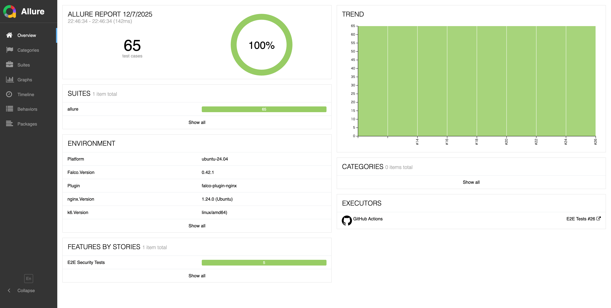
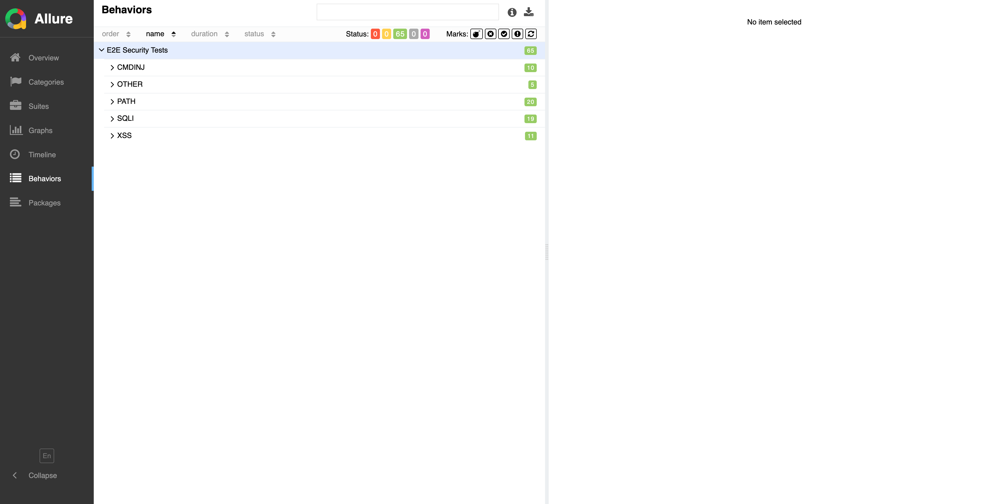
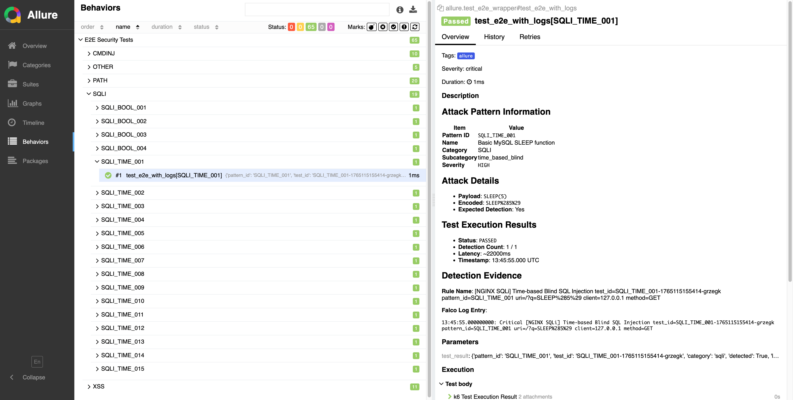
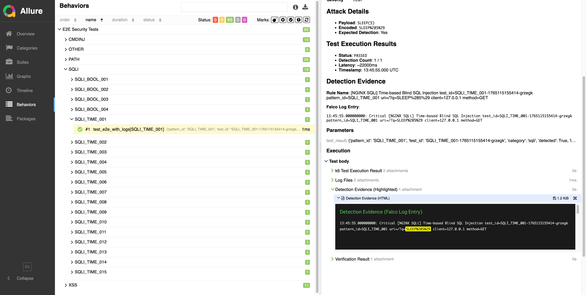
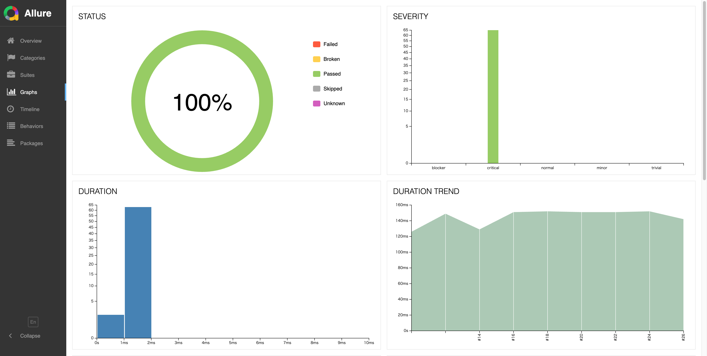

# E2Eテストレポートガイド

このドキュメントでは、Allure Reportフレームワークで生成されるE2Eセキュリティテストレポートの読み方を説明します。

## 目次

1. [概要](#概要)
2. [レポートURL](#レポートurl)
3. [概要ページ](#概要ページ)
4. [ビヘイビアページ](#ビヘイビアページ)
5. [テストケース詳細](#テストケース詳細)
6. [ハイライト機能](#ハイライト機能)
7. [グラフページ](#グラフページ)
8. [テストカテゴリ](#テストカテゴリ)

---

## 概要

E2Eセキュリティテストレポートは、Falco nginxプラグインのセキュリティ検出能力を包括的に可視化します。各テスト実行では、24のカテゴリにわたる**850の攻撃パターン**を実行し、以下を示す詳細なレポートを生成します：

- 検出率（目標：100%）
- カテゴリ別の内訳
- 個別テストケースの詳細
- 実行回数ごとのトレンド分析

---

## レポートURL

E2Eテストレポートは以下のURLで確認できます：

| URL | 説明 |
|-----|------|
| **https://takaosgb3.github.io/falco-plugin-nginx/e2e-report/latest/** | 最新レポート（常に最新の実行結果を表示） |
| **https://takaosgb3.github.io/falco-plugin-nginx/e2e-report/{run_number}/** | 特定の実行（例：run #26） |

### 例

- **最新**: https://takaosgb3.github.io/falco-plugin-nginx/e2e-report/latest/
- **Run #26**: https://takaosgb3.github.io/falco-plugin-nginx/e2e-report/26/

---

## 概要ページ



概要ページでは、テスト実行の高レベルなサマリーを提供します：

### 主要メトリクス

| セクション | 説明 |
|------------|------|
| **Test Cases** | 実行されたテストパターンの総数（850） |
| **Success Rate** | 検出されたパターンの割合（100% = すべて検出） |
| **Suites** | テストスイートの構成 |
| **Environment** | 実行環境の詳細 |

### 環境情報

| フィールド | 説明 |
|------------|------|
| Platform | オペレーティングシステム（ubuntu-24.04） |
| Falco.Version | 使用されたFalcoのバージョン（0.43.0） |
| Plugin | プラグイン名（falco-plugin-nginx） |
| nginx.Version | nginxのバージョン（1.24.0） |
| k6.Version | k6負荷テストツールのバージョン |

### トレンドグラフ

右パネルには、複数の実行回にわたるテスト結果を表示する**Trend**グラフが表示されます。これにより以下を追跡できます：
- 検出率の一貫性
- ルール変更の影響
- 過去のパフォーマンス

### 実行者（Executors）

テストを実行したCI/CDシステム（GitHub Actions）が、ワークフロー実行へのリンクとともに表示されます。

---

## ビヘイビアページ



ビヘイビアページでは、テストを**Epic > Feature > Story**の階層で整理しています：

### カテゴリ別内訳

| カテゴリ | パターン数 | 説明 |
|----------|------------|------|
| **SQLI** | 138 | SQLインジェクション攻撃 |
| **CMDINJ** | 98 | コマンドインジェクション攻撃 |
| **XSS** | 96 | クロスサイトスクリプティング攻撃 |
| **PATH** | 81 | パストラバーサル攻撃 |
| **SSRF** | 41 | サーバーサイドリクエストフォージェリ |
| **SSTI** | 34 | サーバーサイドテンプレートインジェクション |
| **OTHER** | 34 | その他の攻撃パターン |
| **CRLF** | 31 | CRLFインジェクション攻撃 |
| **API** | 30 | APIセキュリティ攻撃 |
| **XPATH** | 25 | XPathインジェクション攻撃 |
| **GRAPHQL** | 25 | GraphQLインジェクション攻撃 |
| **HOST_HEADER** | 21 | Host Headerインジェクション攻撃 |
| **HPP** | 20 | HTTPパラメータ汚染 |
| **OPEN_REDIRECT** | 20 | オープンリダイレクト攻撃 |
| **NOSQL** | 20 | NoSQLインジェクション攻撃 |
| **LDAP** | 20 | LDAPインジェクション攻撃 |
| **WAF_BYPASS** | 18 | WAFバイパス手法 |
| **XXE** | 18 | XML外部エンティティ攻撃 |
| **JWT** | 15 | JWTセキュリティ攻撃 |
| **PROTOTYPE_POLLUTION** | 15 | プロトタイプ汚染攻撃 |
| **HTTP_SMUGGLING** | 15 | HTTPリクエストスマグリング |
| **PICKLE** | 15 | Pickle逆シリアル化攻撃 |
| **INFO_DISCLOSURE** | 10 | 情報漏洩 |
| **AUTH_BYPASS** | 10 | パスベース認証バイパス |

### ステータス表示

- **緑色（850）**：成功したテスト
- **赤色（0）**：失敗したテスト
- **オレンジ色（0）**：壊れたテスト
- **灰色（0）**：スキップされたテスト

カテゴリをクリックすると、個別のテストパターンが展開表示されます。

---

## テストケース詳細



各テストケースでは、攻撃パターンと検出結果に関する詳細情報を提供します：

### 攻撃パターン情報

| フィールド | 説明 | 例 |
|------------|------|-----|
| Pattern ID | 一意の識別子 | `SQLI_TIME_001` |
| Name | わかりやすい名前 | "Basic MySQL SLEEP function" |
| Category | 攻撃カテゴリ | SQLI |
| Subcategory | 具体的な攻撃タイプ | time_based_blind |
| Severity | リスクレベル | HIGH |

### 攻撃詳細

| フィールド | 説明 | 例 |
|------------|------|-----|
| Payload | 生の攻撃文字列 | `SLEEP(5)` |
| Encoded | URLエンコード版 | `SLEEP%285%29` |
| Expected Detection | 検出されるべきか | Yes |

### テスト実行結果

| フィールド | 説明 | 例 |
|------------|------|-----|
| Status | テスト結果 | PASSED |
| Detection Count | 検出数 / 期待数 | 1 / 1 |
| Latency | 検出までの時間 | 約22000ms |
| Timestamp | 検出時刻 | 13:45:55.000 UTC |

### 検出証跡

攻撃を検出した実際のFalcoログエントリ：

```
13:45:55.000000000: Critical [NGINX SQLi] Time-based Blind SQL Injection
test_id=SQLI_TIME_001-1765115155414-grzegk
pattern_id=SQLI_TIME_001
uri=/?q=SLEEP%285%29
client=127.0.0.1
method=GET
```

### 実行ステップ

各テストには、添付ファイル付きの実行ステップが含まれます：

1. **k6 Test Execution Result** - 生のテスト実行データ（JSON）
2. **Log Files** - nginxアクセスログとFalcoログのスニペット
3. **Detection Evidence (Highlighted)** - キーワードハイライト付きHTMLビュー
4. **Verification Result** - 成功/失敗の判定

---

## ハイライト機能



**Detection Evidence (Highlighted)** 添付ファイルでは、**蛍光イエローのハイライト**を使用して、ログエントリ内の攻撃ペイロードを見やすく表示します。

### 動作の仕組み

1. 攻撃パターンからキーワード（ペイロードとエンコード値）を抽出
2. これらのキーワードを`<mark>`タグでハイライト
3. 背景色：`#FFFF00`（蛍光イエロー）

### 例

上のスクリーンショットでは、`SLEEP%285%29`が黄色でハイライトされており、Falcoログエントリ内の攻撃ペイロードを簡単に見つけることができます。

### メリット

- **即座に識別**：検出をトリガーした内容を即座に確認
- **視覚的な確認**：正しいパターンがマッチしたことを確認
- **レビュー時間の短縮**：キーワードを手動で検索する必要なし

---

## グラフページ



グラフページでは、視覚的な分析を提供します：

### ステータス（円グラフ）

テスト結果の分布を表示：
- **緑色**：成功
- **赤色**：失敗
- **オレンジ色**：壊れた
- **灰色**：スキップ
- **紫色**：不明

### 重大度（棒グラフ）

重大度レベル別のテスト数を表示：
- blocker
- critical（ほとんどのE2Eテスト）
- normal
- minor
- trivial

### 所要時間（ヒストグラム）

テスト実行時間の分布を表示。ほとんどのテストは1〜2msで完了します。

### 所要時間トレンド

実行回数ごとの総テスト時間を示す折れ線グラフ。パフォーマンスの低下を特定するのに役立ちます。

### トレンド

実行回数ごとの成功/失敗件数を示す積み上げ棒グラフ。時間の経過に伴う安定性を示します。

### リトライトレンド

実行回数ごとのリトライパターンを表示（理想的には0で平坦）。

### カテゴリトレンド

実行回数ごとのカテゴリ別結果を表示。

---

## テストカテゴリ

### SQLインジェクション（SQLI）- 138パターン

| パターンID | タイプ | 説明 |
|------------|--------|------|
| SQLI_TIME_001-025 | 時間ベースブラインド | SLEEP(), BENCHMARK(), WAITFOR DELAY, pg_sleep |
| SQLI_BOOL_001-025 | ブール値ベースブラインド | OR '1'='1, AND '1'='1, 各種バイパス手法 |
| SQLI_ERR_001-029 | エラーベース | EXTRACTVALUE, UPDATEXML, エラーメッセージ |
| SQLI_ADV_001+ | 高度なSQLi | スタッククエリ、UNIONベース、フィルターバイパス |

**検出ルール**：各種SQL Injectionルール

### コマンドインジェクション（CMDINJ）- 98パターン

| パターンID | タイプ | 説明 |
|------------|--------|------|
| CMDINJ_001+ | シェル/OSコマンド | ;ls, |cat, \`whoami\`, 各種バイパス手法 |

**検出ルール**：Command Injectionルール

### クロスサイトスクリプティング（XSS）- 96パターン

| パターンID | タイプ | 説明 |
|------------|--------|------|
| XSS_REFL_001+ | 反射型/DOM/格納型XSS | script, img onerror, svg onload, iframe, ミューテーションXSS |

**検出ルール**：XSS検出ルール

### パストラバーサル（PATH）- 81パターン

| パターンID | タイプ | 説明 |
|------------|--------|------|
| PATH_001+ | LFI/RFI/ディレクトリ | ../etc/passwd, ....//....// , 各種エンコーディング, Unicodeバイパス |

**検出ルール**：Path Traversalルール

### SSRF（SSRF）- 41パターン

| パターンID | タイプ | 説明 |
|------------|--------|------|
| SSRF_001+ | サーバーサイドリクエストフォージェリ | クラウドメタデータ、内部ネットワーク、hex/IPv6/octal IP |

**検出ルール**：SSRF検出ルール

### SSTI（SSTI）- 34パターン

| パターンID | タイプ | 説明 |
|------------|--------|------|
| SSTI_001+ | テンプレートインジェクション | Jinja2、Pug、EJS、Handlebars、Mako、Nunjucks |

**検出ルール**：SSTI検出ルール

### CRLFインジェクション（CRLF）- 31パターン

| パターンID | タイプ | 説明 |
|------------|--------|------|
| CRLF_001+ | ヘッダーインジェクション | レスポンス分割、Unicode CRLF、ログインジェクション |

**検出ルール**：CRLFインジェクションルール

### APIセキュリティ（API）- 30パターン

| パターンID | タイプ | 説明 |
|------------|--------|------|
| API_001+ | BOLA/認証バイパス | オブジェクト参照操作、マスアサインメント |

**検出ルール**：API Securityルール

### XPathインジェクション（XPATH）- 25パターン

| パターンID | タイプ | 説明 |
|------------|--------|------|
| XPATH_001+ | XPathクエリ | ブールベース、ブラインド、関数悪用 |

**検出ルール**：XPath Injectionルール

### GraphQLインジェクション（GRAPHQL）- 25パターン

| パターンID | タイプ | 説明 |
|------------|--------|------|
| GRAPHQL_001+ | GraphQL攻撃 | イントロスペクション、データ抽出、クエリ悪用 |

**検出ルール**：GraphQL Injectionルール

### Host Headerインジェクション（HOST_HEADER）- 21パターン

| パターンID | タイプ | 説明 |
|------------|--------|------|
| HHI_001+ | Host Header操作 | マルチホスト、CRLF、ポート操作 |

**検出ルール**：Host Headerインジェクションルール

### HPP（HPP）- 20パターン

| パターンID | タイプ | 説明 |
|------------|--------|------|
| HPP_001+ | HTTPパラメータ汚染 | 配列、型ジャグリング、重複パラメータ |

**検出ルール**：HPP検出ルール

### オープンリダイレクト（OPEN_REDIRECT）- 20パターン

| パターンID | タイプ | 説明 |
|------------|--------|------|
| REDIR_001+ | オープンリダイレクト | Data URI、フラグメント、metaリフレッシュ、Unicode |

**検出ルール**：オープンリダイレクトルール

### NoSQLインジェクション（NOSQL）- 20パターン

| パターンID | タイプ | 説明 |
|------------|--------|------|
| NOSQL_001+ | NoSQL/MongoDB | $where, $regex, $gt, Redis, CouchDB |

**検出ルール**：NoSQL Injectionルール

### LDAPインジェクション（LDAP）- 20パターン

| パターンID | タイプ | 説明 |
|------------|--------|------|
| LDAP_001+ | LDAPクエリ操作 | フィルターインジェクション、クエリ操作 |

**検出ルール**：LDAP Injectionルール

### WAFバイパス（WAF_BYPASS）- 18パターン

| パターンID | タイプ | 説明 |
|------------|--------|------|
| WAF_001+ | WAF回避 | チャンク、マルチパート、二重エンコーディング |

**検出ルール**：WAFバイパスルール

### XML外部エンティティ（XXE）- 18パターン

| パターンID | タイプ | 説明 |
|------------|--------|------|
| XXE_001+ | XXE | <!DOCTYPE, <!ENTITY, SYSTEM参照 |

**検出ルール**：XXE検出ルール

### JWTセキュリティ（JWT）- 15パターン

| パターンID | タイプ | 説明 |
|------------|--------|------|
| JWT_001+ | JWT攻撃 | KIDインジェクション、X5U、JWE、リプレイ、JWKS |

**検出ルール**：JWTセキュリティルール

### プロトタイプ汚染（PROTOTYPE_POLLUTION）- 15パターン

| パターンID | タイプ | 説明 |
|------------|--------|------|
| PROTO_001+ | プロトタイプ汚染 | \_\_proto\_\_、constructor.prototype |

**検出ルール**：プロトタイプ汚染ルール

### HTTPスマグリング（HTTP_SMUGGLING）- 15パターン

| パターンID | タイプ | 説明 |
|------------|--------|------|
| SMUGGLE_001+ | リクエストスマグリング | CL.TE、TE.CL、リクエスト分割 |

**検出ルール**：HTTPスマグリングルール

### Pickle/デシリアライゼーション（PICKLE）- 15パターン

| パターンID | タイプ | 説明 |
|------------|--------|------|
| PICKLE_001+ | デシリアライゼーション | Python Pickle悪用 |

**検出ルール**：デシリアライゼーションルール

### 情報漏洩（INFO_DISCLOSURE）- 10パターン

| パターンID | タイプ | 説明 |
|------------|--------|------|
| INFO_001+ | 情報漏洩 | サーバー情報、デバッグエンドポイント、エラーページ |

**検出ルール**：情報漏洩ルール

### パスベース認証バイパス（AUTH_BYPASS）- 10パターン

| パターンID | タイプ | 説明 |
|------------|--------|------|
| AUTHBYPASS_001+ | パス操作 | パス正規化、大文字小文字操作 |

**検出ルール**：認証バイパスルール

### その他（OTHER）- 34パターン

| パターンID | タイプ | 説明 |
|------------|--------|------|
| OTHER_001+ | 追加パターン | 各種セキュリティパターン |

**検出ルール**：その他検出ルール

---

## クイックリファレンス

### 結果の解釈

| 指標 | 意味 | アクション |
|------|------|----------|
| 100%成功 | すべての攻撃が検出された | 良好 - ルールが正常に動作 |
| 100%未満 | 一部の攻撃が見逃された | 失敗したテストを確認し、ルールを更新 |
| カテゴリ別の失敗 | 特定カテゴリの問題 | そのカテゴリのルール改善に注力 |

### よくある問題

| 問題 | 原因 | 解決策 |
|------|------|--------|
| 低い検出率 | ルールがマッチしない | ルール条件とフィールド名を確認 |
| 高いレイテンシ | ログ処理が遅い | Falcoのパフォーマンスとログ量を確認 |
| 証跡がない | ログローテーション/切り詰め | ログ保持期間を延長 |

### ヘルプ

- **リポジトリ**：https://github.com/takaosgb3/falco-plugin-nginx
- **Issues**：https://github.com/takaosgb3/falco-plugin-nginx/issues
- **ワークフロー**：`.github/workflows/e2e-test.yml`

---

## バージョン履歴

| バージョン | 日付 | 変更内容 |
|------------|------|----------|
| 2.0.0 | 2026-03-03 | v1.8.0対応（850パターン、24カテゴリ） |
| 1.0.0 | 2025-12-07 | 初版リリース |

---

*このドキュメントは[falco-plugin-nginx](https://github.com/takaosgb3/falco-plugin-nginx)プロジェクトの一部です。*
